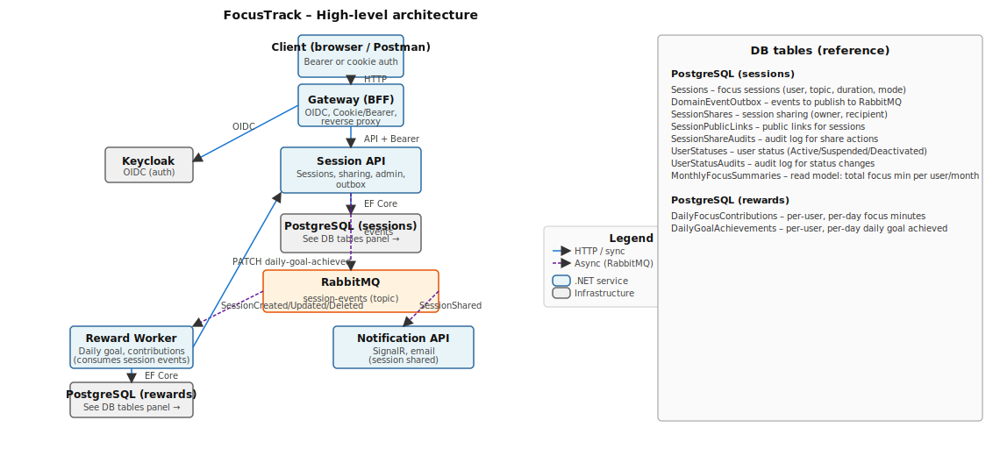

# FocusTrack

Focus session and reward tracking backend: sessions, sharing, daily goals, notifications, and admin features. Built with .NET 8, Keycloak (OIDC), PostgreSQL, and RabbitMQ.

---

## One-command startup

From the repository root:

```bash
docker compose up
```

This starts:

| Service           | Port(s)   | Description                          |
|-------------------|-----------|--------------------------------------|
| **Gateway**       | 5000      | BFF, OIDC, reverse proxy to backends |
| **Session API**   | 5001      | Sessions, sharing, admin, outbox     |
| **Notification API** | 5002   | SignalR + email (session shared)     |
| **Keycloak**      | 9080      | OIDC identity provider               |
| **RabbitMQ**      | 5672, 15672 | Message broker + Management UI    |
| **PostgreSQL (sessions)** | 5432 | Session and outbox data        |
| **PostgreSQL (rewards)**  | 5433 | Rewards and daily goal data     |
| **Jaeger**        | 16686, 4317 | Tracing UI + OTLP                 |

- **App entry point:** [http://localhost:5000](http://localhost:5000) (Gateway).
- **Keycloak admin:** [http://localhost:9080](http://localhost:9080) (admin / admin).
- **RabbitMQ Management:** [http://localhost:15672](http://localhost:15672) (guest / guest).
- **Jaeger UI:** [http://localhost:16686](http://localhost:16686).

For local development you can run only infrastructure and start Gateway and Session API from Visual Studio; see [docs/Testing-with-Postman.md](docs/Testing-with-Postman.md).

---

## High-level architecture



**Flows:**

1. **Client → Gateway**  
   Browser or Postman calls the Gateway (cookie auth or Bearer token from Keycloak).

2. **Gateway → Keycloak**  
   OIDC login/challenge; Gateway issues cookies or client uses token endpoint for Bearer.

3. **Gateway → Session API**  
   Authenticated requests are proxied to Session API with Bearer and user/role headers.

4. **Session API → PostgreSQL (sessions)**  
   Sessions, sharing, user status, and domain events (outbox) are persisted.

5. **Session API → RabbitMQ**  
   Outbox processor publishes domain events (SessionCreated, SessionUpdated, SessionDeleted, SessionShared, UserStatusChanged) to the `session-events` topic exchange.

6. **RabbitMQ → Reward Worker**  
   Consumes session events; updates daily contributions and daily goal achievements; calls Session API to set `IsDailyGoalAchieved`; optionally publishes `DailyGoalAchievedEvent`.

7. **RabbitMQ → Notification API**  
   Consumes `SessionSharedEvent`; notifies recipients via SignalR (online) or email (offline).

8. **Reward Worker → PostgreSQL (rewards)**  
   Stores daily focus contributions and daily goal achievements.

9. **Reward Worker → Session API**  
   Internal PATCH to mark session as daily-goal achieved when the user crosses the threshold.

---

## Key design decisions and trade-offs

| Decision | Rationale | Trade-off |
|----------|-----------|-----------|
| **Gateway as BFF** | Single entry point for browser and API clients; handles OIDC, cookies, and Bearer; forwards to backends with internal API key. | Extra hop and configuration; enables consistent auth and routing. |
| **Dual auth (Cookie + Bearer)** | Browsers use cookie-based OIDC; Postman/API clients use Bearer from Keycloak token endpoint. | Logout with Bearer does not revoke the token server-side; client discards token. |
| **Outbox pattern (Session API)** | Domain events are written to `DomainEventOutbox` in the same transaction as session changes; background processor publishes to RabbitMQ and sets `ProcessedAt`. Avoids losing events if RabbitMQ is down at commit time. |
| **Publisher confirms (RabbitMQ)** | Session API uses a shared connection and channel with publisher confirms so `ProcessedAt` is set only after broker ack. | Reduces risk of “marked processed but not delivered”; slight latency. |
| **Separate DBs (sessions vs rewards)** | Session API owns session and outbox data; Reward Worker owns contributions and achievements. | Enables independent scaling and schema evolution |
| **Topic exchange `session-events`** | One exchange; routing keys (e.g. `SessionCreatedEvent`, `SessionSharedEvent`) let each consumer bind only to what it needs. | Simple routing; consumers declare their own queues and bindings. |
| **User status in Session API** | Admin user status (Active/Suspended/Deactivated) stored in Session API; Gateway checks it on token validation and blocks login for non-Active. | Central place for “can this user log in?”; Gateway depends on Session API at login time. |
| **Notification: SignalR vs email** | Online users get real-time SignalR; offline users get email (or stub log) via configurable SMTP and UserId→email mapping. |

---

### Observability

- **Tracing:** OTLP to Jaeger (or another backend) is already configured for Gateway, Session API, and Notification API. Use the same endpoint in production and correlate requests across services.
- **Health:** Expose health endpoints (e.g. `/healthz`, `/readyz`) and use them for load balancer and orchestrator health checks. Add DB and RabbitMQ checks in readiness.
- **Logging:** Structured logging (e.g. Serilog) with levels and correlation IDs; ship logs to a central store (e.g. ELK, Azure Monitor) for debugging and auditing.

---

## Documentation

- [Testing with Postman](docs/Testing-with-Postman.md) – Setup, tokens, and test flows (U2–U5, A1–A3).
- [Keycloak roles](docs/Keycloak-Roles-Setup.md) – Realm and client roles (User, Admin).
- [Architecture diagram](docs/architecture.svg) – Services and message flows (SVG).
